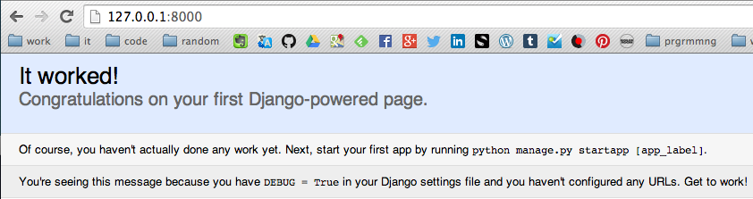

python-django
=============

A Python Django framework tryout.

After downloading Python i decided to tryout the Django framework. 
I got a version from the GitHub project:
[https://github.com/django/django/tree/stable/1.7.x](https://github.com/django/django/tree/stable/1.7.x)

# Installing Django on Mac OS X
1. open IDLE (installed with Python)
2. can django be found?  
	Command:  
	<code>import django</code>  
	<code>print(django.get_version())</code>
3. if not, is django on Python's search path?
	* print Python's search path  
		Command:  
		<code>import sys</code>  
		<code>print(sys.path)</code>  
		  
		Output:  
		<code>
		['', '/Users/user-name/Documents', '/Library/Frameworks/Python.framework/Versions/3.4/lib/python34.zip', '/Library/Frameworks/Python.framework/Versions/3.4/lib/python3.4', '/Library/Frameworks/Python.framework/Versions/3.4/lib/python3.4/plat-darwin', '/Library/Frameworks/Python.framework/Versions/3.4/lib/python3.4/lib-dynload', '/Library/Frameworks/Python.framework/Versions/3.4/lib/python3.4/site-packages']
		</code>  
		  
		We now know that the site-packages directory can be found in:  
		/Library/Frameworks/Python.framework/Versions/3.4/lib/python3.4/site-packages  
		  
		source: [https://docs.python.org/2/install/index.html#modifying-python-s-search-path](https://docs.python.org/2/install/index.html#modifying-python-s-search-path)  
	* request Python's site-packages directory  
		Another way to find the site-packages directory is by executing following, command:  
		<code>python -c "from distutils.sysconfig import get_python_lib; print(get_python_lib())"</code>  
		  
		source: [https://docs.djangoproject.com/en/1.6/topics/install/#id1](https://docs.djangoproject.com/en/1.6/topics/install/#id1)  
4. add django's path to Python's search  
	Add a new django.pth file in folder:  
	/Library/Frameworks/Python.framework/Versions/3.4/lib/python3.4/site-packages/  
	containing the path to the django framework:  
	python-django-directory/python-django/django/django-stable-1.7.x  
	  
	Don't forget to replace *python-django-directory* by your local directory!
		
	source: [https://docs.djangoproject.com/en/1.6/topics/install/#id1](https://docs.djangoproject.com/en/1.6/topics/install/#id1)  
5. restart IDLE
6. retry step 2  
	Command:  
	<code>import django</code>  
	<code>print(django.get_version())</code>    
	  
	Output:  
	<code>1.7b4</code>

# Tutorial 01
## Generate a project using Django
Open the terminal and go to the new project's folder using 'cd'.  
Teminal command:  
<code>bash</code>  
<code>python-django-directory/python-django/django/django-stable-1.7.x/django/bin/django-admin.py startproject mysite</code>  
  
Don't forget to replace *python-django-directory* by your local directory!

## Generated file overview
- mysite/ : root directory
- manage.py : command line utility for project interaction
- mysite/ (inner) : actual Python project package
- mysite/\_\_init__.py : empty file, tells Python this directory is a package
- mysite/settings.py : Django project settings configuration
- mysite/urls.py : URL declarations
- mysite/wsgi.py : WSGI web servers entry-point

## Set the correct timezone
Your local timezone needs to be set in  mysite/settings.py.  
A list of correct timezones can be found on: [http://en.wikipedia.org/wiki/List_of_tz_database_time_zones](http://en.wikipedia.org/wiki/List_of_tz_database_time_zones)  
I had to choose 'Europe/Brussels'.

## Create database tables
Terminal command:  
<code>bash</code>  
<code>python-django-directory/python-django/python-django/tutorial01/mysite/manage.py migrate</code>  
  
Don't forget to replace *python-django-directory* by your local directory!  
  
Output:  
<code>Operations to perform:</code>  
<code>- Synchronize unmigrated apps: admin, contenttypes, auth, sessions</code>  
<code>- Apply all migrations: (none)</code>  
<code>Synchronizing apps without migrations:</code>  
<code>- Creating tables...</code>  
<code>- - Creating table django_admin_log</code>  
<code>- - Creating table auth_permission</code>  
<code>- - Creating table auth_group_permissions</code>  
<code>- - Creating table auth_group</code>  
<code>- - Creating table auth_user_groups</code>  
<code>- - Creating table auth_user_user_permissions</code>  
<code>- - Creating table auth_user</code>  
<code>- - Creating table django_content_type</code>  
<code>- - Creating table django_session</code>  
<code>- Installing custom SQL...</code>  
<code>- Installing indexes...</code>  
<code>Running migrations:</code>  
<code>- No migrations needed.</code>  
</code>  
  
Question?  
<code>You have installed Django's auth system, and don't have any superusers defined.  
Would you like to create one now? (yes/no):</code> <code>yes</code>  

Question?
<code>Username (leave blank to use 'user-name'):</code> <code>admin</code>

Question?
<code>Email address:</code> <code>admin@tutorial01.com</code>  
  
Question?
<code>Password:</code> <code>admin01</code>  
  
Output: <code>Superuser created successfully.</code>  

## Start the webserver
Terminal command:  
<code>bash</code>  
<code>python-django-directory/python-django/python-django/tutorial01/mysite/manage.py runserver</code>  

The project can now be viewed on [http://127.0.0.1:8000/](http://127.0.0.1:8000/)  
